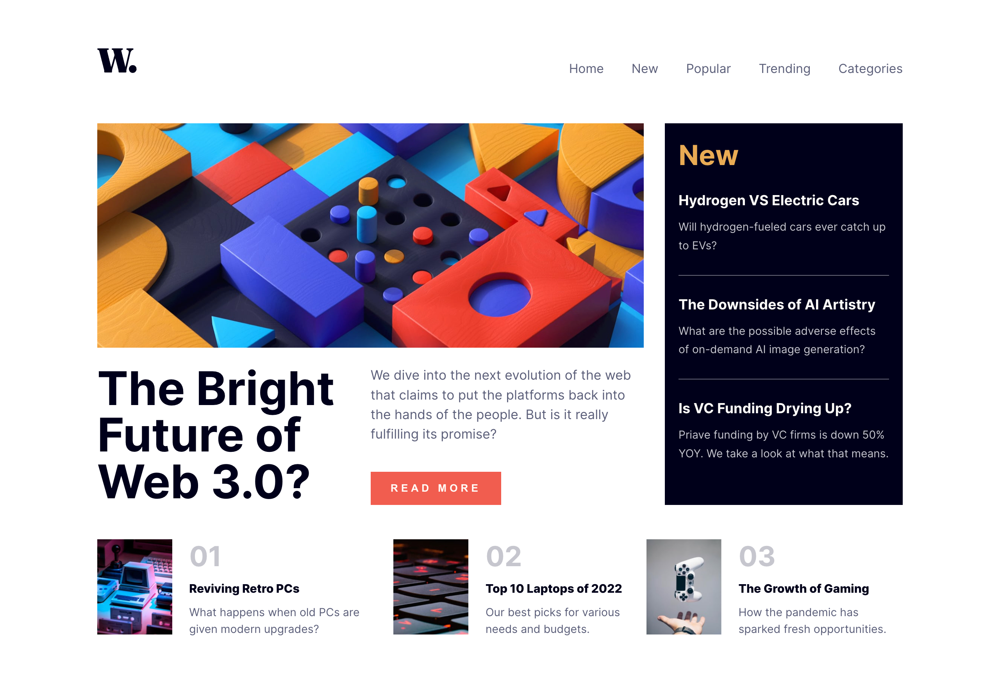

# Frontend Mentor - News homepage solution

This is my solution to the [News homepage challenge on Frontend Mentor](https://www.frontendmentor.io/challenges/news-homepage-H6SWTa1MFl).

## Table of contents

- [Overview](#overview)
  - [The challenge](#the-challenge)
  - [Screenshot](#screenshot)
  - [Links](#links)
- [My process](#my-process)
  - [Built with](#built-with)
  - [What I learned](#what-i-learned)
  - [Continued development](#continued-development)
  - [Useful resources](#useful-resources)
- [Author](#author)

## Overview

### The challenge

Users should be able to:

- View the optimal layout for the interface depending on their device's screen size
- See hover and focus states for all interactive elements on the page

### Screenshot



### Links

- Solution URL: (https://github.com/Sanket-rgb/news-homepage)
- Live Site URL: (https://sk-news-homepage.netlify.app)

## My process

### Built with

- Semantic HTML5 markup
- CSS modules
- Flexbox
- SCSS
- Mobile-first workflow
- [React](https://reactjs.org/) - JS library
- [SASS](https://sass-lang.com) - CSS preprocessor

### What I learned

- Import global CSS variables using CSS modules and SASS.

<!-- Declare Global variables -->

```_global.scss
$primary-color: #aaaaa;
$secondary-color: #bbbbb;
```

<!-- Import Global variables-->

```example.module.scss
@import './Styles/Global/global'

.container {
  color: $primary-color
}
```

- Get WindowInnerWidth.

```js
const getWindowInnerWidth = () => {
  console.log(window.innerWidth);
};
```

- Write clean and DRY code.

### Continued development

I am looking forward to implement the following features:

1. Integrate news fetching API such as Google News API.
2. Build further upon Single-Page-Application using react-router-dom.
3. Improve application layout and performance.

### Useful resources

- (https://www.markdownguide.org/) - This helped me to learn how to import global css variables in .module.scss files. It is just the basis but, with this you can fully utilize the SASS features in CSS modules.

## Author

- Website - [Sanket Koli](https://www.your-site.com)
- Frontend Mentor - [@Sanket-rgb](https://www.frontendmentor.io/profile/Sanket-rgb)
- LinkedIn - [@sanketkoli007](https://www.linkedin.com/in/sanketkoli007/)
- GitHub - [@Sanket-rgb](https://github.com/Sanket-rgb)
